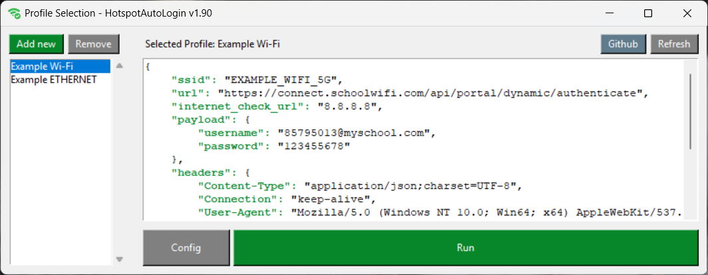

# HotspotAutoLogin: Automatic Wi-Fi/Ethernet WEB Logins (Automate WEB/Captive Portal Logins)
HotspotAutoLogin is a script that designed to automate the login process for Wi-Fi or Ethernet networks that require web-based authentication. This script is intended for situations where you often connect to networks that require a web login, such as public hotspots in cafes, hotels, or airports. The script continuously monitors the internet connection and automatically logs you in when necessary.




> # [Download the Latest Executable (.exe) Release](https://github.com/denizsafak/HotspotAutoLogin/releases/latest)
> You can download the executable (.exe) version of the same script, making it easy to use without the need to install Python or other libraries.

## `How to Run?`

### Option 1: Executable Script
- If you don't want to install Python, you can download the precompiled executable version from the Releases section.
[Download the Latest Executable (.exe) Release](https://github.com/denizsafak/HotspotAutoLogin/releases/latest)
- Double-click on HotspotAutoLogin.exe to launch the application.

### Option 2: Run with Python
- Clone or download the repository to your local machine.
- Install Python to your computer.
- Run "run.bat" file.

## `Features`
- The script will continuously monitor the internet connection. When you connect to the specified SSID but there is no internet access, it will attempt to log in automatically.
- If you are connected to the correct SSID but lack internet access, the script attempts to log in by sending an POST request to the provided URL with the specified credentials. If the login is successful, the script will continue monitoring.
- Any important events or actions taken by the script are logged both in a log file (log.txt) and in the log window that can be accessed via the system tray icon.
- The script reads its configuration from a config.json file. This file contains the necessary information, such as your login credentials, the URL of the authentication portal, the SSID (network name) to which you want to connect, and the frequency of network checks in seconds.

## `Usage`
- Edit the config.json file with your specific information, including your login credentials, the portal URL, the SSID of the network you want to connect to, and the check interval in seconds. [Click to learn how to Configure the config.json](#how-to-configure-the-configjson)
- When you run the script, a system tray icon will appear. Right-click on the icon to access options like showing the log or exiting the application.
- You can view the log of the script's actions by clicking the "Show Log" option in the system tray menu.

## `How to Configure the config.json?`


1) When you're in the web login page, open your browser's Developer Tools. (You can press F12 or Ctrl + Shift + I (or Cmd + Option + I on Mac) to open the Developer Tools. Alternatively, you can right-click anywhere on the page and select "Inspect" or "Inspect Element.")
2) **Navigate to the Network Tab:** In the Developer Tools, click on the "Network" tab.
3) **Trigger the POST Request:** Perform the action that sends the POST request. <ins>**(You can try to login with incorrect password)**</ins>. The network tab will capture all network requests made by the page, including your POST request.
4) **Locate the POST Request:** You need to find yours. Look for the POST request in the list of network requests. It will typically have a method of "POST" and the URL it was sent to.

`"payload":` Go to "Payload" tab and enter the payload values here.


`"url":` Enter the "Request URL" in the "Headers" tab here.

`"internet_check_url":` Adress to check the internet connection. If you can access "8.8.8.8" without logging into your network, please change this.


`"ssid":` This is your network's SSID. For example "MyHome_5G" **(If you are using a wired (ethernet) connection, you don't need to enter ssid**

`"check_every_second":` The frequency of the script for checking your internet connection status. For example "100", it will try to check the internet every 100 seconds.

> ## Example useage:
> 

```json
{
    "profiles": [
        {
            "name": "My School Wi-Fi",
            "ssid": "SCHOOL_WIFI_5G",
            "url": "https://connect.schoolwifi.com/api/portal/dynamic/authenticate",
            "internet_check_url": "8.8.8.8",
            "payload": {
                "username": "85795013@myschool.com",
                "password": "123455678"
            },
            "headers": {
                "Content-Type": "application/json;charset=UTF-8",
                "Connection": "keep-alive",
                "User-Agent": "Mozilla/5.0 (Windows NT 10.0; Win64; x64) AppleWebKit/537.36 (KHTML, like Gecko) Chrome/58.0.3029.110 Safari/537.3"
            },
            "check_every_second": 600,
            "dialog_geometry": {
                "width": 1024,
                "height": 500
            }
        },
        {
            "name": "My School ETHERNET",
            "url": "http://10.3.41.15:8002/index.php?zone=dormnet",
            "payload": "&auth_user=85795013%40myschool.com&auth_pass=123455678&redirurl=&accept=Login",
            "internet_check_url": "8.8.8.8",
            "headers": {
                "Content-Type": "application/x-www-form-urlencoded",
                "Connection": "keep-alive",
                "User-Agent": "Mozilla/5.0 (Windows NT 10.0; Win64; x64) AppleWebKit/537.36 (KHTML, like Gecko) Chrome/118.0.0.0 Safari/537.36 Edg/118.0.2088.69"
            },
            "check_every_second": 600,
            "dialog_geometry": {
                "width": 1024,
                "height": 500
            }
        }
    ]
}
```


> [!CAUTION]
> If you get:
> 
> ```Could not find a Wi-Fi network with SSID: {}. If your Wi-Fi is disabled, please enable it. Checking again in {} seconds...```
> 
> error, **even with the correct SSID**, it’s likely due to recent Windows updates that restrict third-party apps from accessing Wi-Fi names unless location services are enabled. To fix this, turn on location services in your settings. For more details, check the article from 04/02/2024 [Changes to API behavior for Wi-Fi access and location](https://learn.microsoft.com/en-us/windows/win32/nativewifi/wi-fi-access-location-changes).

> [!NOTE]
> - The script relies on the assumption that the web portal uses basic authentication. If the portal uses a more complex login mechanism, additional adjustments may be necessary.
> - This script is primarily intended for Windows. Adaptations might be needed for other operating systems.

## Disclaimer
> Use this script responsibly and only on networks where you have the right to access and use the provided services. Unauthorized access to networks is illegal and unethical.

> Tags: Auto Connect WiFi, Wifi Login Wizard, Wifi Auto Login, Auto Hotspot Login, Hotspot Auto Connect, Hotspot Automator, Auto Hotspot Sign In, Wifi Auto Sign In, Web Login Automator, WiFi Login Automator, Hotspot Login Automator, WEB Portal Auto Login, Quick Hotspot Connect
